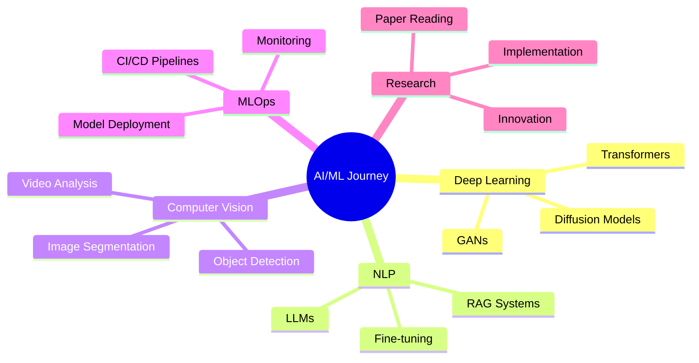

# 🚀 Adithya U Prabhu

<div align="center">
  
</div>

<p align="center">
  
</p>

<div align="center">
  
  
  
  
  
</div>

<p align="center">
  <a href="mailto:adithyauprabhu3@gmail.com">
    
  </a>
  <a href="https://linkedin.com/in/adithya-u-prabhu">
    
  </a>
  <a href="tel:+918078599527">
    
  </a>
  <a href="https://github.com/adithya-u-prabhu">
    
  </a>
</p>

<div align="center">
  
</div>

---

## 🧠 About Me

<div align="center">
  
</div>

<div align="center">
  
</div>

```python
class MachineLearnngEngineer:
    def __init__(self):
        self.name = "Adithya U Prabhu"
        self.role = "Machine Learning Engineer 🤖"
        self.location = "Bengaluru, India 🇮🇳"
        self.education = {
            "degree": "B.Tech in Computer Science & Engineering",
            "specialization": "Artificial Intelligence & Machine Learning",
            "university": "Christ University (Deemed to be)",
            "graduation": "2026"
        }
        self.languages = {
            "human": ["Malayalam", "English", "Hindi", "Konkani"],
            "programming": ["Python", "C", "JavaScript", "SQL"]
        }
        
    def career_objective(self):
        return """
        🎯 Aspiring ML Engineer with strong foundation in Python, Deep Learning,
        and algorithmic problem-solving. Passionate about building intelligent
        systems that solve real-world problems. Proficient in full-stack ML
        development from model training to deployment.
        """
    
    def current_focus(self):
        return {
            "🔬 Research": "AI/ML Research & Development",
            "📚 Learning": "GANs, Transformers, and LLMs",
            "🤝 Collaboration": "Open Source Contributions",
            "🚀 Building": "End-to-End ML Production Systems",
            "🎨 Exploring": "Generative AI & Diffusion Models"
        }
    
    def technical_skills(self):
        return {
            "ML_Frameworks": ["TensorFlow", "PyTorch", "Scikit-Learn", "Keras"],
            "Computer_Vision": ["OpenCV", "YOLO", "Image Processing"],
            "NLP": ["LangChain", "Transformers", "Text Classification"],
            "Databases": ["MySQL", "PostgreSQL", "MongoDB"],
            "Tools": ["Git", "Docker", "Streamlit", "React", "MATLAB"],
            "Cloud": ["AWS", "MLOps"]
        }
    
    def get_dream(self):
        return "To democratize AI and make it accessible to everyone! 🌍"

# Initialize the AI Engineer
me = MachineLearnngEngineer()
print(f"✨ Mission: {me.get_dream()}")
```

<div align="center">
  
</div>

---

## 💼 Professional Experience

<div align="center">
  
</div>

### 🏢 Machine Learning Intern | **Thinking Code PVT LTD**
 

- 🚀 Built production-ready **Carbon Footprint Tracker** for climate action initiatives
- 👥 Collaborated in **4-member agile development team** on full-stack ML applications
- 🔧 Developed end-to-end ML pipelines from data preprocessing to deployment
- 🌟 Demonstrated strong teamwork and technical leadership skills

### 🏢 Machine Learning Intern | **Bharat Intern**
 

- 📊 Implemented supervised and unsupervised learning algorithms
- 🎯 Delivered end-to-end ML solutions with 90%+ accuracy
- 📈 Conducted comprehensive EDA and feature engineering
- 🚀 Deployed models using Streamlit for interactive demonstrations

<div align="center">
  
</div>

---

## 🔧 Skills & Technologies

<div align="center">
  
  
  
  
</div>

<div align="center">
  
</div>

### 💻 Programming Languages
<p align="center">
  
  
  
  
  
</p>

<div align="center">
  
</div>

### 🧠 AI/ML Frameworks & Libraries
<p align="center">
  
  
  
  
  
  
  
  
</p>

<div align="center">
  
</div>

### 🗄️ Databases & Cloud
<p align="center">
  
  
  
  
</p>

<div align="center">
  
</div>

### 🔧 Development Tools & Frameworks
<p align="center">
  
  
  
  
  
  
</p>

<div align="center">
  
</div>

### 🎯 Soft Skills
<p align="center">
  
  
  
  
  
  
</p>

---

## 🚀 Featured Projects

<div align="center">
  
</div>

<div align="center">
  
</div>

### 🎯 Machine Learning Projects

<table>
<tr>
<td width="50%" valign="top">

#### 🏠 House Price Prediction
 

- Advanced regression model with feature engineering
- Hyperparameter tuning using GridSearchCV
- Interactive web app with Streamlit
- Real-time price predictions

**Tech Stack:** `Python` `Scikit-Learn` `Pandas` `Streamlit`

</td>
<td width="50%" valign="top">

#### 🌸 Iris Flower Classification
 

- Multi-class classification pipeline
- Comprehensive EDA with visualizations
- Model comparison (SVM, RF, KNN)
- Feature importance analysis

**Tech Stack:** `Python` `Scikit-Learn` `Matplotlib` `Seaborn`

</td>
</tr>

<tr>
<td width="50%" valign="top">

#### 🎬 Movie Recommendation System
 

- Collaborative filtering algorithm
- Content-based recommendation
- Hybrid model for better accuracy
- Interactive UI with real-time suggestions

**Tech Stack:** `Python` `Pandas` `Cosine Similarity` `Streamlit`

</td>
<td width="50%" valign="top">

#### 💬 Chat with PDF
 

- RAG (Retrieval-Augmented Generation)
- LangChain integration
- Document parsing and embedding
- Context-aware question answering

**Tech Stack:** `Python` `LangChain` `OpenAI` `FAISS` `Streamlit`

</td>
</tr>

<tr>
<td width="50%" valign="top">

#### 🚗 Indian License Plate Detection
 

- Real-time vehicle detection with YOLO
- License plate recognition using OCR
- Image preprocessing and enhancement
- High accuracy in various conditions

**Tech Stack:** `Python` `OpenCV` `YOLO` `Tesseract OCR`

</td>
<td width="50%" valign="top">

#### 📰 Fake News Classification
 

- Text preprocessing and cleaning
- TF-IDF feature extraction
- Ensemble learning approach
- Model interpretability with LIME

**Tech Stack:** `Python` `NLTK` `Scikit-Learn` `TF-IDF`

</td>
</tr>
</table>

<div align="center">
  
</div>

### 🔬 Research Projects

<table>
<tr>
<td width="50%" valign="top">

#### 🍔 Disease Prediction Based on Food Consumption
 

- Correlation analysis between diet and health
- Predictive modeling for preventive healthcare
- Large-scale dataset analysis
- Research paper in development

**Tech Stack:** `Python` `Pandas` `Scikit-Learn` `Statistical Analysis`

</td>
<td width="50%" valign="top">

#### 🎭 Hybrid Deep Learning for Deepfake Detection
 

- CNN + LSTM hybrid architecture
- Multi-modal feature extraction
- Video frame analysis
- Focus on AI-generated content detection

**Tech Stack:** `PyTorch` `OpenCV` `FFmpeg` `Deep Learning`

</td>
</tr>
</table>

<div align="center">
  
</div>

---

## 📊 GitHub Analytics

<div align="center">
  
</div>

<div align="center">
  
  
</div>

<div align="center">
  
</div>

<div align="center">
  
</div>

<div align="center">
  
</div>

<div align="center">
  
  
</div>

<div align="center">
  
</div>

---

## 🏆 Certifications & Achievements

<div align="center">
  
</div>

<table>
<tr>
<td width="33%" align="center">
  
  <br><b>MathWorks</b>
  <br>Mathematical Computing
</td>
<td width="33%" align="center">
  
  <br><b>MongoDB University</b>
  <br>Schema Patterns
</td>
<td width="33%" align="center">
  
  <br><b>MongoDB University</b>
  <br>Model Migration
</td>
</tr>
<tr>
<td width="33%" align="center">
  
  <br><b>Cisco</b>
  <br>Network Professional
</td>
<td width="33%" align="center">
  
  <br><b>Cognitive Class</b>
  <br>AI Certificate
</td>
<td width="33%" align="center">
  
  <br><b>L&T Edutech</b>
  <br>Technical Training
</td>
</tr>
<tr>
<td width="33%" align="center">
  
  <br><b>Oracle Academy</b>
  <br>Core Java
</td>
<td width="33%" align="center">
  
  <br><b>Oracle Academy</b>
  <br>Advanced Java
</td>
<td width="33%" align="center">
  
  <br><b>NPTEL</b>
  <br>Project Management
</td>
</tr>
</table>

<div align="center">
  
</div>

---

## 🌐 Languages

<div align="center">
  
</div>

<table align="center">
<tr>
<td align="center" width="25%">
  
  <br><b>Native</b>
  <br>Speak • Read • Write
</td>
<td align="center" width="25%">
  
  <br><b>Fluent</b>
  <br>Speak • Read • Write
</td>
<td align="center" width="25%">
  
  <br><b>Proficient</b>
  <br>Speak • Partial Write
</td>
<td align="center" width="25%">
  
  <br><b>Conversational</b>
  <br>Speak
</td>
</tr>
</table>

---

## 🎯 Current Mission & Learning Path

<div align="center">
  
</div>

<div align="center">
  
</div>



### 🚀 Focus Areas 2024-2026

<table align="center">
<tr>
<td align="center" width="20%">
  
  <br><b>Large Language Models</b>
  <br>GPT, BERT, LL
